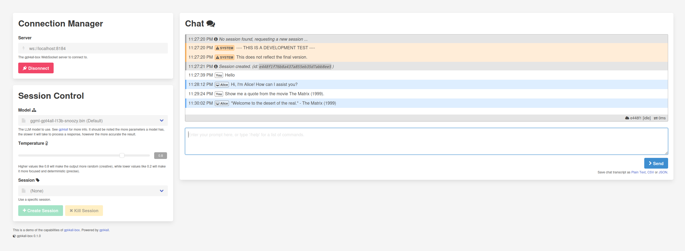

# gpt4all-box

Gpt4All Q/A prompt session service-in-a-box. (for internal-use only, not meant for public servers, yet...)



Want `wss://` (SSL/TLS) support for the agent? Use a TLS terminating nginx reverse proxy.

### Usage

First build the Docker image:
```sh
./docker-build.sh
```

Next run the image as a container, see examples below.

You can open the `examples/ui.html` on your local web browser to access the client chat UI.


#### Development

This will run a development container WebSocket server on TCP port 8184.

You can connect to this via the the **UI** or **CLI** HTML page examples located in `examples/`.

Why are we not specifying `-u "$(id -u):$(id -g)"` ?

Because the `~/.cache/gpt4all` directory must exist, and therefore it needs a user internal to the docker container.
Apparently the value `model_path` can be set in our `gpt.py`, but we're not doing that right now.

```sh
docker run --rm -it \
	-e SYSTEM_MESSAGE="This is an example!" \
	-e HEARTBEAT_INTERVAL=5000 \
	-p 8184:8184 \
	-v "$(pwd):/mnt" \
	gpt4all-box
```

#### Production
```sh
docker run --name gpt4all-box \
	--detach \
	--publish 8184:8184 \
	--volume "$(pwd):/mnt" \
	gpt4all-box
```

### Environment Variables

| Name                       | Default                         | Description                                                                            |
|----------------------------|---------------------------------|----------------------------------------------------------------------------------------|
| MODEL_PATH                 | ./models/                       | Directory path of where to save the models.                                            |
| MODEL_THREADS              | 4                               | Number of CPU threads for the LLM agent to use.                                        |
| MODEL_DOWNLOADS            | https://raw.githubusercontent.com/nomic-ai/gpt4all/main/gpt4all-chat/metadata/models2.json | Where to download the model binaries from.                                             |
| SYSTEM_MESSAGE             |                                 | Set an announcement message to send to clients on connection.                          |
| SKIP_INTEGRITY_CHECK       | False                           | Check the hash of each model individually against the models.json hash.                |
| HEARTBEAT_INTERVAL         | 5000                            | How often events are processed internally, such as session pruning.                    |
| MAX_IDLE_SESSION_DURATION  | 180000                          | Execute stale session purge after this period.                                         |
